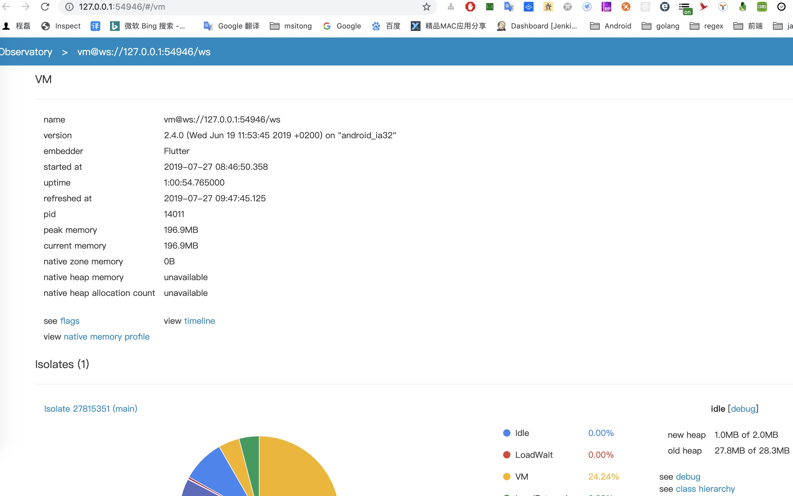
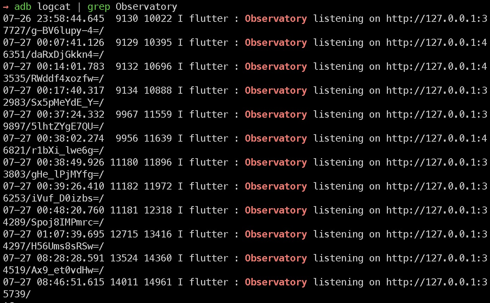
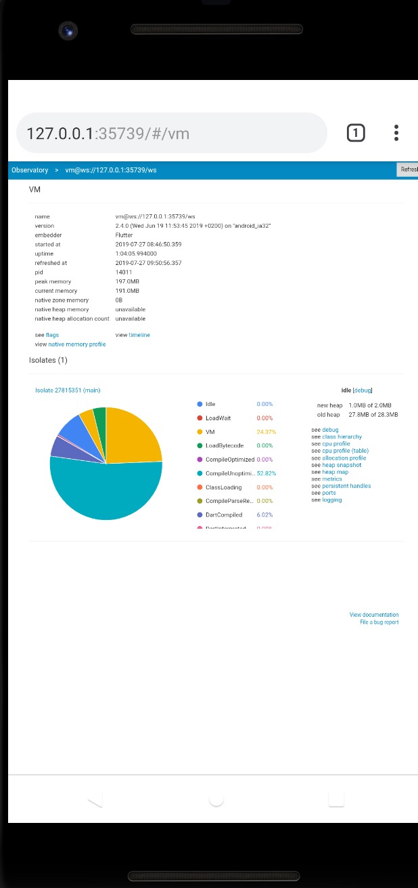
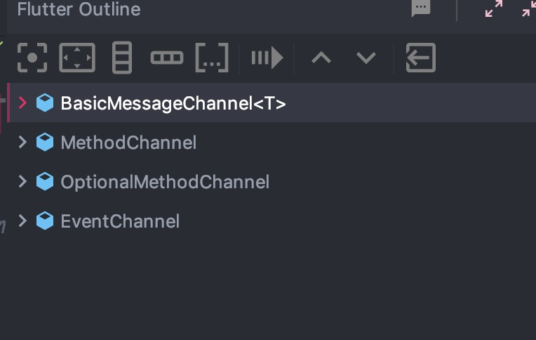
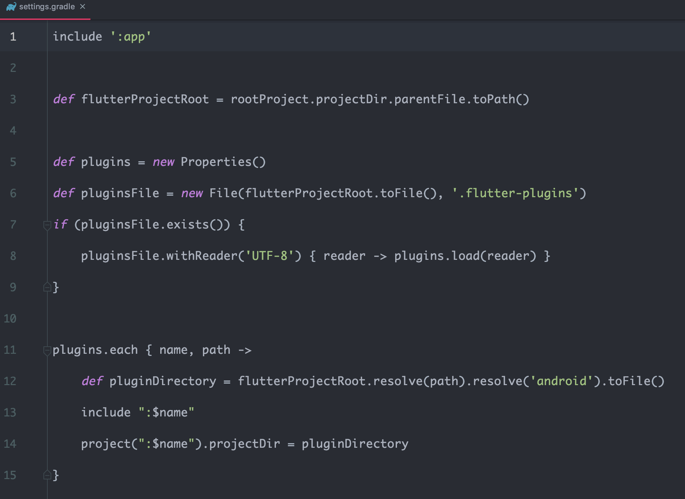
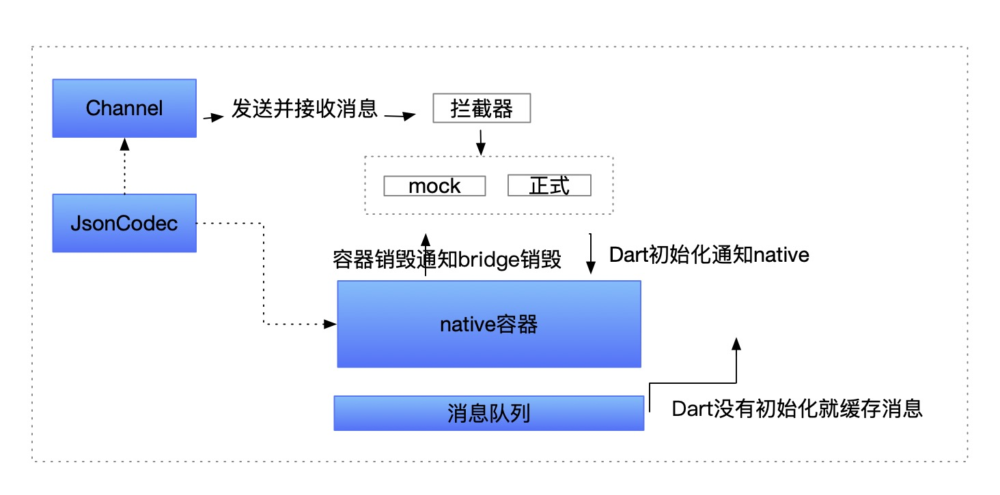

# Flutter 在铭师堂的实践

## 简介

## Flutter 的架构和原理

Flutter framework 层的架构图如下：


 
 **Foundation**: foundation 提供了 framework 经常使用的一些基础类，包括但不限于：

 * BindBase: 提供了提供单例服务的对象基类，提供了 Widgets、Render、Gestures等能力

 * Key: 提供了 Flutter 常用的 Key 的基类

 * AbstractNode：表示了控件树的节点

在 foundation 之上，Flutter 提供了 动画、绘图、手势、渲染和部件，其中部件就包括我们比较熟悉的 Material 和 Cupertino 风格

我们从 dart 的入口处关注 Flutter 的渲染原理

```dart
void runApp(Widget app) {
  WidgetsFlutterBinding.ensureInitialized()
    ..attachRootWidget(app)
    ..scheduleWarmUpFrame();
}
```

我们直接使用了 Widgets 层的能力

### widgets
负责根据我们 dart 代码提供的 Widget 树，来构造实际的虚拟节点树

在 FLutter 的渲染机制中，有 3 个比较关键的概念：

* Widget： 我们在 dart 中直接编写的 Widget，表示控件
* Element：实际构建的虚拟节点，所有的节点构造出实际的控件树，概念是类似前端经常提到的 vitrual dom
* RenderObject： 实际负责控件的视图工作。包括布局、渲染和图层合成


根据 `attachRootWidget` 的流程，我们可以了解到布局树的构造流程

1. `attachRootWidget` 创建根节点
2. `attachToRenderTree` 创建 root Element
3. Element 使用  `mount` 方法把自己挂载到父 Element。这里因为自己是根节点，所以可以忽略挂载过程
4. `mount` 会通过 `createRenderObject` 创建 root Element 的 RenderObject

到这里，整颗 tree 的 root 节点就构造出来了，在 `mount` 中，会通过 `BuildOwner#buildScope` 执行子节点的创建和挂载, 这里需要注意的是 child 的 RenderObject 也会被 attach 到 parent 的 RenderObejct 上去

整个过程我们可以通过下图表示


感兴趣可以参考 `Element`、`RenderObjectElement`、`RenderObject` 的源码


### 渲染
负责实际整个控件树 RenderObject 的布局和绘制

runApp 后会执行 `scheduleWarmUpFrame` 方法，这里就会开始调度渲染任务，进行每一帧的渲染

从 `handleBeginFrame` 和 `handleDrawFrame` 会走到 binding 的 `drawFrame` 函数，依次会调用 `WidgetsBinding` 和 `RendererBinding` 的 `drawFrame`。

这里会通过 Element 的 `BuildOwner`，去重新塑造我们的控件树。

大致原理如图


在构造或者刷新一颗控件树的时候，我们会把有改动部分的 Widget 标记为 dirty，并针对这部分执行 rebuild，但是 Flutter 会有判断来保证尽量复用 Element，从而避免了反复创建 Element 对象带来的性能问题。

在对 dirty elements 进行处理的时候，会对它进行一次排序，排序规则参考了 element 的深度:

```dart
static int _sort(Element a, Element b) {
    if (a.depth < b.depth)
      return -1;
    if (b.depth < a.depth)
      return 1;
    if (b.dirty && !a.dirty)
      return -1;
    if (a.dirty && !b.dirty)
      return 1;
    return 0;
  }
```

根据 depth 排序的目的，则是为了保证子控件一定排在父控件的左侧, 这样在 build 的时候，可以避免对子 widget 进行重复的 build。

在实际渲染过程中，Flutter 会利用 **Relayout Boundary**机制

```dart
void markNeedsLayout() {
    // ...
    if (_relayoutBoundary != this) {
      markParentNeedsLayout();
    } else {
      _needsLayout = true;
      if (owner != null) {
        owner._nodesNeedingLayout.add(this);
        owner.requestVisualUpdate();
      }
    }
    //...
  }
```

在设置了 relayout boundary 的控件中，只有子控件会被标记为 needsLayout，可以保证，刷新子控件的状态后，控件树的处理范围都在子树，不会去重新创建父控件，完全隔离开。

在每一个 RendererBinding 中，存在一个 `PipelineOwner` 对象，类似 WidgetsBinding 中的 `BuildOwner`. `BuilderOwner` 负责控件的build 流程，`PipelineOwner` 负责 render tree 的渲染。

```dart
@protected
  void drawFrame() {
    assert(renderView != null);
    pipelineOwner.flushLayout();
    pipelineOwner.flushCompositingBits();
    pipelineOwner.flushPaint();
    renderView.compositeFrame(); // this sends the bits to the GPU
    pipelineOwner.flushSemantics(); // this also sends the semantics to the OS.
  }
```

RenderBinding 的 `drawFrame` 实际阐明了 render obejct 的渲染流程。即 布局(layout)、绘制(paint)、合成(compositeFrame)


### 调度(scheduler和线程模型)

在布局和渲染中，我们会观察到 Flutter 拥有一个 `SchedulerBinding`,在 frame 变化的时候，提供 callback 进行处理。不仅提供了帧变化的调度，在 `SchedulerBinding` 中，也提供了 task 的调度函数。这里我们就需要了解一下 dart 的异步任务和线程模型。

dart 的单线程模型，所以在 dart 中，没有所谓的主线程和子线程说法。dart 的异步操作采取了 event-looper 模型。


dart 没有线程的概念，但是有一个概念，叫做 isolate, 每个 isolate 是互相隔离的，不会进行内存的共享。在 main isolate 的 main 函数结束之后，会开始一个个处理 event queue 中的 event。也就是，dart 是先执行完同步代码后，再进行异步代码的执行。所以如果存在非常耗时的任务，我们可以创建自己的 isolate 去执行。


每一个 isolate 中，存在 2 个 event queue
* Event Queue
* Microtask Queue

event-looper 执行任务的顺序是

1. 优先执行 Microtask Queue 中的task
2. Microtask Queue 为空后，才会执行 Event Queue 中的事件

flutter 的异步模型如下图


### Gesture

每一个 GUI 都离不开手势/指针的相关事件处理。

在 GestureBiding 中，在 `_handlePointerEvent` 函数中，`PointerDownEvent` 事件每处理一次，就会创建一个 `HintTest` 对象。在 `HintTest` 中，会存有每次经过的控件节点的 path。

最终我们也会看到一个 `dispatchEvent` 函数，进行事件的分发以及 `handleEvent`，对事件进行处理。

在根节点的 renderview 中，事件会开始从 `hitTest` 处理，因为我们添加了事件的传递路径，所以，时间在经过每个节点的时候，都会被”处理“。

```dart
@override // from HitTestDispatcher
  void dispatchEvent(PointerEvent event, HitTestResult hitTestResult) {
    if (hitTestResult == null) {
      assert(event is PointerHoverEvent || event is PointerAddedEvent || event is PointerRemovedEvent);
      try {
        pointerRouter.route(event);
      } catch (exception, stack) {
      }
      return;
    }
    for (HitTestEntry entry in hitTestResult.path) {
      try {
        entry.target.handleEvent(event, entry);
      } catch (exception, stack) {
      }
    }
  }
```

这里我们就可以看出来 Flutter 的时间顺序，从根节点开始分发，一直到子节点。同理，时间处理完后，会沿着子节点传到父节点，最终回到 `GestureBinding`。
这个顺序其实和 Android 的 View 事件分发 和 浏览器的事件冒泡 是一样的。

通过 `GestureDector` 这个 Widget, 我们可以触发和处理各种这样的事件和手势。具体的可以参考 Flutter 文档。

### Material、Cupertino

Flutter 在 Widgets 之上，实现了兼容 Andorid/iOS 风格的设计。让APP 在 ui/ue 上有类原生的体验。


## Flutter 的工程实践

根据我们自己的实践，我从 **混合开发**、**基础库建设**和**日常的采坑**的角度，分享一些我们的心得体会。

### 混合工程

我们的 APP 主题大部分是 native 开发完成的。为了实践 Flutter，我们就需要把 Flutter 接入到原生的 APP 里面去。并且能满足如下需求：

* 对不参与 Flutter 实践的原生开发同学不产生影响。不需要他们去安装 Flutter 开发环境
* 对于参与 FLutter 的同学来说，我们要共享一份dart 代码，即共享一个代码仓库

我们的原生架构是多 module 组件化，每个 module 是一个 git 仓库，使用 google git repo 进行管理。以 Android 工程为例，为了对原生开发没有影响。最顺理成章的思路就是，提供一个 aar 包。对于 Android 的视角来说，flutter 其实只是一个 flutterview，那么我们按照 flutter 的工程结构自己创建一个相应的 module 就好了。

我们查看 `flutter create` 创建的flutter project的Andorid的 `build.gradle`，可以找到几个关键的地方

app的`build.gradle`

```grovvy
apply from: "$flutterRoot/packages/flutter_tools/gradle/flutter.gradle"

flutter {
    source '../..'
}
```

这里制定了 flutter 的gradle，并且制定了 flutter 的source 文件目录。

我们可以猜测出来，flutter相关的构建和依赖，都是 flutter 的gradle 文件里面帮我们做的。那么在我们自己创建的原生 module 内部，也用同样的方式去组织。就可以了。

同时，我们可以根据自己的实际去制定 flutter 的 source 路径。也通过 repo 将原生的module 和 dart 的lib目录，分成2个git仓库。就完美实现了代码的隔离。对于原生开发来说，后面的构建打包等持续集成都不会收到 flutter 的影响。

混合工程的架构大概如下：


### 混合工程启动和调试
在一个 flutter 工程中，我们一般是使用 `flutter run` 命令启动一个 flutter 应用。这时候我们就会有关注到：混合工程中，我们进入app会先进入原生页面，如何再进入 flutter 页面。那么我们如何使用热重载和调试功能呢。

**热重载**

以 Andorid 为例，我们可以先给 app 进行 `./gradlew assembleDebug` 打出一个 apk 包。

然后使用
```shell
flutter run --use-application-binary {debug apk path}
```
命令。会启动我们的原生 app， 进入特定的 flutter 入口页面，命令行会自动出现 flutter 的 hot reload。

**混合工程调试**

那么我们如何进行 flutter 工程的调试呢？我们可以通过给原生的端口和移动设备的 `Observatory` 端口进行映射。其实这个方法也同样适用于我们运行了一个纯 flutter 应用，想通过类似 attach 原生进程的方式里面开始断点。

命令行启动app， 出现flutter 的hotreload 后，我们可以看到

```
An Observatory debugger and profiler on Android SDK built for x86 is available at:
http://127.0.0.1:54946/
```

这端。这个地址，我们可以打开一个关于 dart 的性能和运行情况的展示页面。



我们记录下这个端口 xxxx

然后通过 `adb logcat | grep Observatory` 查看手机的端口，可以看到如下输出



我们把最后一个地址输入到手机的浏览器，可以发现手机上也可以打开这个页面



我们可以理解成这里是做了一次端口映射，设备上的端口记录为 yyyy

在 Android Studio 中，我们在 run -> Edit Configurations 里面，新建一个 `dart remote debug`, 填写 xxxx 端口。


如果不成功，可以手动 forward 一下

```
adb forward tcp:xxxx tcp:yyyy
```

然后启动这个调试器，就可以进行 dart 的断点调试了。

### 调用原生和插件开发

在 flutter 开发中，我们需要经常使用原生的功能，具体的可以参考 [官方文档](https://flutter-io.cn/docs/development/platform-integration/platform-channels)， native 和 flutter 通过传递消息，来实现互相调用。

大概的架构图如下


查看源码，可以看到 flutter 包括 4 中 Channel 类型。



* `BasicMessageChannel` 是发送基本的信息内容的通道
* `MethodChannel`和 `OptionalMethodChannel`是发送方法调用的通道
* `EventChannel` 是发送事件流 `stream` 的通道。

在对这些功能进行的封装, 官方提供了 `Plugin` 的概念。也提供了 `Plugin` 工程的脚手架。创建一个 `Plugin` 工程，包括三端的 lib 代码，也包括了一个 `example` 目录。里面是一个依赖了插件的 flutter 应用工程。具体可以参考[插件文档](https://flutter-io.cn/docs/development/packages-and-plugins/using-packages)

在实际的操作中，我们发现，flutter的插件工程是通过 `flutter.gradle` 依赖的 android module， 并且如果在插件的 dart 代码中依赖了其他插件，原生部分代码，不能依赖到插件的原生 aar。这样每次编译的时候就会在 `GeneratedPluginRegistrant` 这个类中报错。

这是为什么呢，通过比较，我们会发现 Flutter 应用工程对比插件工程，在`settings.gradle` 中有一些不一样。应用的工程中，有如下一段代码



gradle 会去读取一个 `.flutter-plugins` 文件。从这里面读取到插件的原生工程地址，include 进来并制定了 path。我们也可以大致猜测到，flutter的 gradle 脚本里面会把自己include进来的插件工程全部依赖一遍。

从这个角度，我们会发现插件工程开发还是有一些规则上的限制的。必须写一些插件类。如果依赖其他的插件，必须写一段类似的脚本进行依赖。不够灵活。而且插件工程仍然需要至少一个android 同学 加一个 iOS 同学进行维护。

所以我们在涉及原生的 Flutter 基础库开发中，没有采用原生工程的方式。而是通过独立的 fluter package、独立的android ios module打包的形式开发。

### flutter基础设置之路

基于上一小节的结论，我们整改了自己的 flutter 基础设置建设。我们的基建大致从下面几个角度出发

* flutter dart代码的组织架构、状态管理库的选择、常用 ui 组件的封装
* flutter 基于 app 现状，开发一套和原生相互调用的代码，把一些需要收拢入口的行为进行封装，例如网络请求、日志上报、页面埋点
* 针对新技术的稳定性考虑，做好线上开关和异常收集

目前，ewt app在webview 的通信方面，是在消息到达另一端后，通过统一的路由调用格式进行路由调用。对于路由提供方来说，只识别路由协议，不关心调用端是哪一段。我们大概的协议是

`scheme://{"domain":"", "action":"", "params":""}`

在一定程度上，我们也可以把统一的路由协议理解为“跨平台”

所以在原生的通信中，结合实际业务场景，我们没有使用 `MethodChannel`，而是使用了 `BasicMessageChannel`, 通过这一个 channel，发送最基本的路由协议。被调用方收到后，调用各自的路由库，返回调用结果给通道。我们封装了一套 `DartBridge` 来进行消息的传递。

通过，阅读源码我们可以发现，Channel 的设计非常的完美。它解耦了消息的编解码方式，在 `Codec` 对象中，我们可以进行我们的自定义编码，例如序列化为 json 对象。

```dart
var _dartBridgeChannel = BasicMessageChannel(DART_BRIDGE_CHANNEL,JSONMessageCodec());
```

在实际开发中，我们可能想要查询消息内容。如果消息的内容是获取原生的内容，例如一个学生的作业总数，我们希望在原生提供服务前，不阻塞自己的开发。并且在不修改业务代码的情况下获取到路由的mock数据。所以我们在路由的内部增加了拦截器和mock服务的功能。在sdk初始化的时候，我们可以通过对象配置的方式，配置一些对应 domain、action的mock数据。

整个 DartBridge 的架构大致如下



基于这个架构模型，我们收到消息后，通过原生路由（例如 ARouter）方案，去进行相应的跳转或者服务调用。

在此基础上，我们进行了如下几个基础库的封装

#### 网络库 EIO

Flutter 提供了自己的http 包。但是集成到原生app的时候，我们仍然希望网络这个基础操作的口子可以被统一管理。包括统一的https支持，统一的网络拦截操作，以及可能进行的统一网络监控和调优。所以在Android中，网络库我们选择调用 OKHttp。

但是考虑到如果有新的业务需求，我们开发了一个全新的flutter app，也希望在不更改框架层的代码，就可以直接移植过去，并且脱离原生的请求。

这就意味着网络架构需要把 `网络配置` 和 `网络引擎` 解耦开。本着不重复造轮子的原则，我们发现了一个非常优秀的框架：`DIO`

DIO 留下了一个 `HttpClientAdapter` 类，进行网络请求的自定义。

我们实现了这个类，在 `fetch()` 函数中，通过 `DartBridge`，对原生的网络请求模块进行调用。返回的数据是一个包括：

* nativeBytes List<Int> 网络数据的字节流
* statusCode 网络请求的 http code
* headers Map<String, dynamic> 网络的 response headers

这些数据，通过 Okhttp 请求可以获取。这里有一个细节问题。在 OkHttp 中，请求到的 bytes是一个 byte[], 直接给到dart 这边，被我强转成了一个List<int>, 因为java 中 byte的范围是 -126 - 127 ，所以这时候，就出现了乱码。

通过对比实际的dart dio请求到的相同的字节流，我发现，byte中的一些数据转换成int的时候发生了溢出，变成了负数，产生了乱码。正好是做一次补码运算，就成了正确的。所以。我在 dart 端，对数据做了一次统一的转化：

```dart
nativeBytes = nativeBytes.map((it) {
      if (it < 0) {
        return it + 256;
      } else {
        return it;
      }
    }).toList();
```

关于 utf8 和 byte 具体的编解码过程，我们不做赘述。感兴趣的同学可以参考一下[这篇文章](https://blog.csdn.net/sinat_38816924/article/details/78438070)

### 统一跳转

在 bridge 框架的基础上，我们对接原生的路由框架封装了我们自己的统一跳转。目前我们的架构还比较简单，采用了还是多容器的架构，在业务上去规避这点。我们的容器页面其实就是一个 `FlutterActivity`，我们给容器也设置了一个 path，原生在跳转flutter的时候，其实是跳转到了这个容器页。在容器页中，拿到我们实际的 Flutter path 和 参数。伪代码如下：

```kotlin
val extra = intent?.extras
        extra?.let {
            val path = it.getString("flutterPath") ?: ""
            val params = HashMap<String, String>()
            extra.keySet().forEach { key ->
                extra[key]?.let { value ->
                    params[key] = value.toString()
                }
            }
            path.isNotEmpty().let {
                // 参数通过 bridge 告诉flutter的第一个 widget
                // 在flutter页面内实现真正的跳转
                DartBridge.sendMessage<Boolean>("app", "gotoFlutter",HashMap<String,String>().apply {
                  put("path", path)
                  put("params", params)
                }, {success->
                    Log.e("native跳转flutter成功", success.toString())
                }, { code, msg->
                    Log.e("native跳转flutter出错", "code:$code;msg:$msg")
                })
            }
        }
```

那么，业务在原生跳往 Flutter 页面的时候，我们每次都需要知道容器页面的path吗，很明显是不能这样的。
所以我们在上面叙述的基础上，抽象了一个 flutter 子路由表。进行单独维护。
业务只需要跳往自己的子路由表内的 path，在 SDK内部，会把实际的path 替换成容器的 path，把路由表 path 和跳转参数整体作为实际的参数。

在 Andorid 中，我提供了一个 `pretreatment` 函数，在 `ARouter` 的 `PretreatmentService` 中调用进行处理。返回最终的路由 path 和 参数。

### 线上开关
为了保证新技术的稳定，我在 Flutter 基础 SDK 中，提供了一个全局开关的配置。